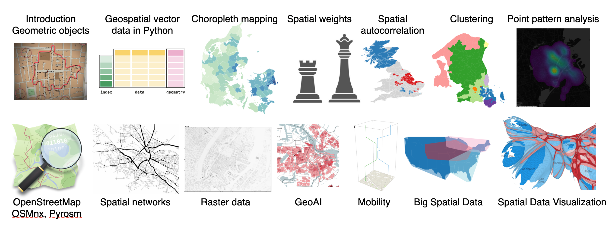

# Course materials for: Geospatial Data Science

These course materials cover the lectures for the course held for the first time in spring 2022 at IT University of Copenhagen. Newest version of the course materials is from spring 2023. Public course page: [https://learnit.itu.dk/local/coursebase/view.php?ciid=1170&view=public](https://learnit.itu.dk/local/coursebase/view.php?ciid=1170&view=public)  
Materials were slightly improved and reordered after the course.

**Prerequisites**: Basics in data science (including statistics, Python and pandas)  
**Ideal level/program**: 1st year Master in Data Science

## Topics

· 1. Geometric objects · 2. Geospatial vector data in Python · 3. Choropleth mapping · 4. Spatial weights · 5. Spatial autocorrelation · 6. Spatial clustering · 7. Point pattern analysis · 8. OpenStreetMap, OSMnx and Pyrosm · 9. Spatial networks · 10. Spatial raster data in Python · 11. GeoAI · 12. Mobility · 13. Big spatial data · 14. Spatial data visualization

## Exercise materials and tutorials

See: [https://github.com/anerv/GDS_exercises](https://github.com/anerv/GDS_exercises)

Get in touch if you want access to exercise solutions (not shared publicly).

## Schedule

## Course readings & resources

See full list of student readings and resources [here](https://github.com/mszell/geospatialdatascience/blob/2023/course_readings.md)

## Sources

The course materials were adapted/inspired from a number of sources, *standing on the shoulders of giants*, ordered by appearance in the course:

### Main sources

* Tenkanen, Heikinheimo, Aagesen: [Automating GIS-processes](https://autogis-site.readthedocs.io/en/latest/)
* Arribas-Bel: [Geographic Data Science](https://darribas.org/gds_course/content/home.html)
* Rey, Arribas-Bel, Wolf: [Geographic Data Science with Python](https://geographicdata.science/book/intro.html)
* [GIS&T Body of Knowledge](<https://gistbok.ucgis.org/>)
* Gimond: [Intro to GIS and Spatial Analysis](https://mgimond.github.io/Spatial/index.html)
* Tenkanen: [Spatial data science for sustainable development](https://sustainability-gis.readthedocs.io/en/latest/index.html)
* Boeing: [OSMnx](https://github.com/gboeing/osmnx-examples/tree/main/notebooks)
* Tenkanen: [pyrosm](https://pyrosm.readthedocs.io/en/latest/index.html)
* Gaboardo, Rey, Lumnitz: [spaghetti](https://pysal.org/spaghetti/)
* Pappalardo: [scikit-mobility](https://github.com/scikit-mobility/tutorials)
* Alessandretti, Szell: [Urban Mobility](https://arxiv.org/abs/2211.00355) (developed after the course)

### Other major sources and further materials

* Prapas: [Analyze Geospatial Data in Python: GeoPandas and Shapely](https://www.learndatasci.com/tutorials/geospatial-data-python-geopandas-shapely/)
* Tan, Steinbach, Kumar: Introduction to Data Mining
* Timaite, Lovelace: [Getting started with open data on transport infrastructure](https://udsleeds.github.io/openinfra/articles/openinfra.html)
* Rodrigue: [The Geography of Transport Systems](https://transportgeography.org/)
* Barthelemy: [Spatial Networks](https://link.springer.com/book/10.1007/978-3-030-94106-2)
* Barbosa et al: [Human mobility: Models and applications](https://doi.org/10.1016/j.physrep.2018.01.001)
* Mobility papers: [Brockmann et al](https://www.nature.com/articles/nature04292), [Gonzalez et al](https://www.nature.com/articles/nature06958), [Szell et al](https://www.nature.com/articles/srep00457), [Song et al](https://www.science.org/doi/abs/10.1126/science.1177170), [Pappalardo et al](https://www.nature.com/articles/ncomms9166), [Song et al](https://www.nature.com/articles/nphys1760), [De Montjoye et al](https://www.nature.com/articles/srep01376), [Schneider et al](https://royalsocietypublishing.org/doi/abs/10.1098/rsif.2013.0246), [Sekara et al](https://www.pnas.org/content/113/36/9977.short), [Simini et al](https://www.nature.com/articles/nature10856), [Brockmann & Helbing](https://www.science.org/doi/10.1126/science.1245200), [Szell et al](https://www.nature.com/articles/s41598-022-10783-y)
* Kapp: [Privacy-preserving techniques and how they apply to mobility data](https://alexandrakapp.blog/2022/03/14/privacy-preserving-techniques-and-how-they-apply-to-mobility-data/)
* Batty: [The New Science of Cities](https://mitpress.mit.edu/books/new-science-cities)
* Barthelemy: [The Structure and Dynamics of Cities](https://www.cambridge.org/core/books/structure-and-dynamics-of-cities/50359353B081D0A38928961FE16FB2FD)
* OECD: [Transport Strategies for Net-Zero Systems by Design](https://www.oecd.org/environment/transport-strategies-for-net-zero-systems-by-design-0a20f779-en.htm)
* TU Delft: [Introduction to Urban Data Science](<https://cusp.tbm.tudelft.nl/courses/epa1316/>)
* [The GDSL Big List of Teaching Links](https://github.com/GDSL-UL/Teaching_Links)

More sources are referenced within the slides and notebooks.

## License

All materials were used for educational, non-commercial reasons only. Feel free to use as you wish for the same purpose, at your own risk. For other re-use questions please consult the license of the respective source. Our main sources use the [CC BY-SA 4.0 license](https://creativecommons.org/licenses/by-sa/4.0/) so we use it too.

## Credits

Lectures: [Michael Szell](http://michael.szell.net/) & [Ane Rahbek Vierø](<https://anerv.github.io/>)

[Exercises and tutorials](https://github.com/anerv/GDS_exercises): Ane Rahbek Vierø, Anastassia Vybornova & Jan Leonard Schelhaas

Thanks to all our main sources for being so helpful and open with your materials! Special thanks to Adéla Sobotkova for helpful discussions and materials concerning syllabus, exam form, and project description, and to Vedran Sekara for slide materials.
